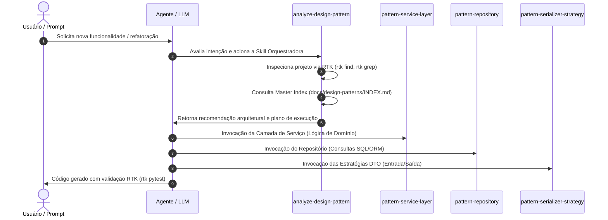

# Arquitetura e Orquestração: Analyze Design Pattern

## Diagrama de Sequência de Orquestração

## Relação com a Base de Conhecimento (`docs/design-patterns/`)

- [Master Index de Design Patterns]($DOC_DIR/design-patterns/INDEX.md)
- [Resumo GoF de Seleção e Aplicação]($DOC_DIR/design-patterns/design-pattern-references/desgin-patterns.md#9-como-escolher-um-pattern)
- [Service Design Patterns — API Styles & Boundary Layer]($DOC_DIR/design-patterns/service-pattern-references/service-design-patterns.md#6-cap%C3%ADtulo-2--web-service-api-styles)
